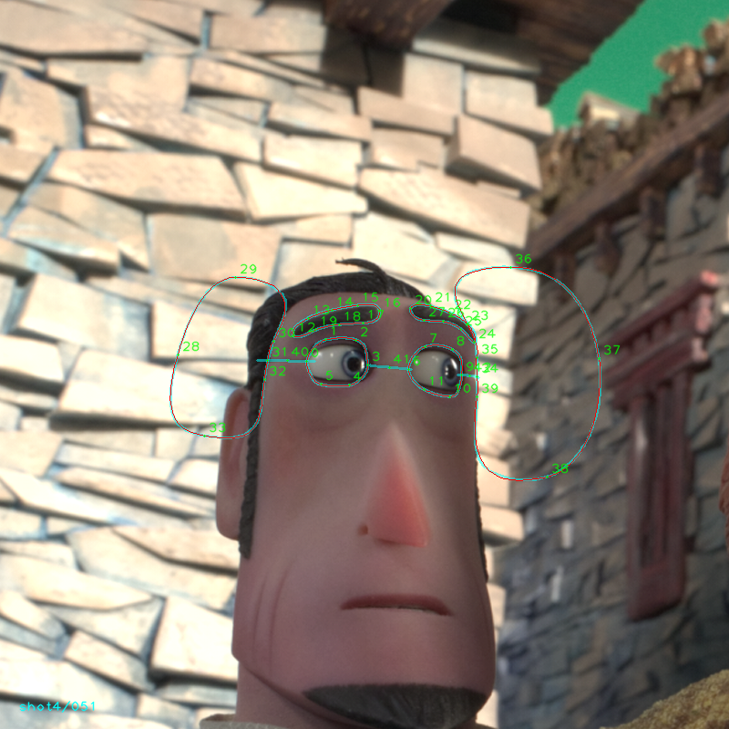
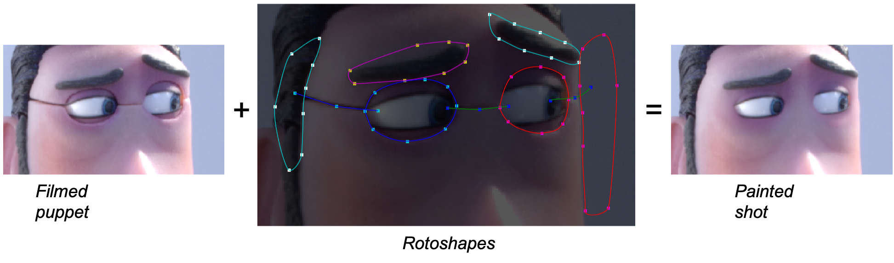
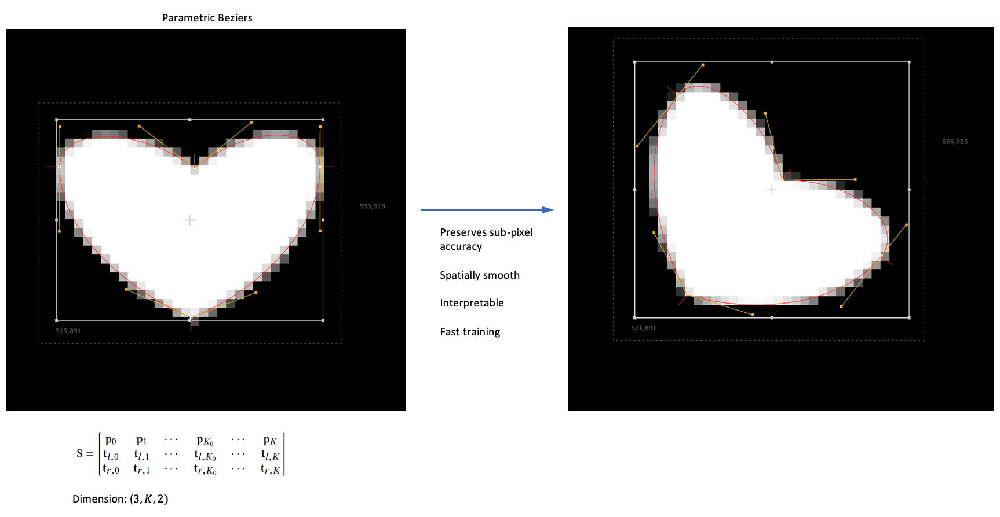
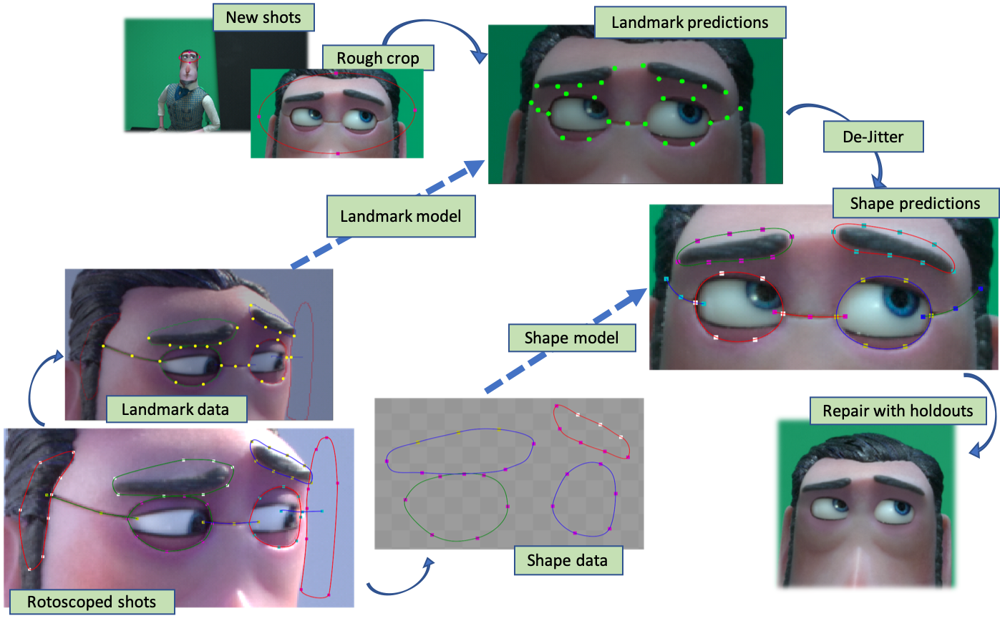
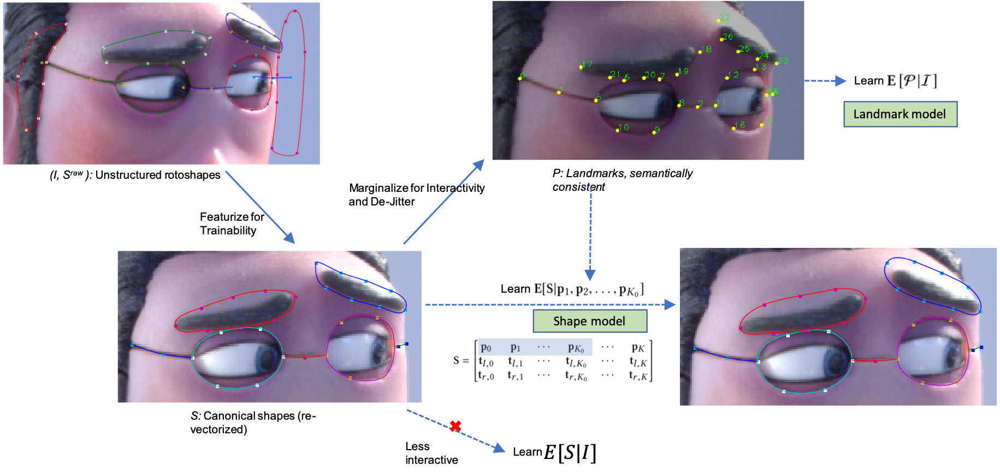
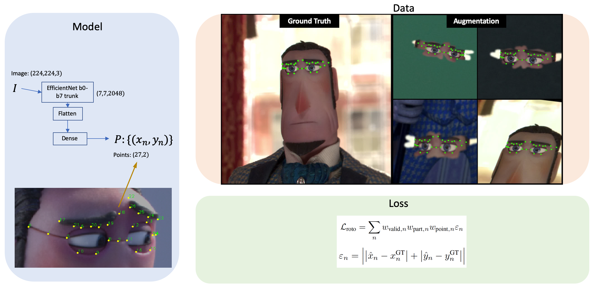
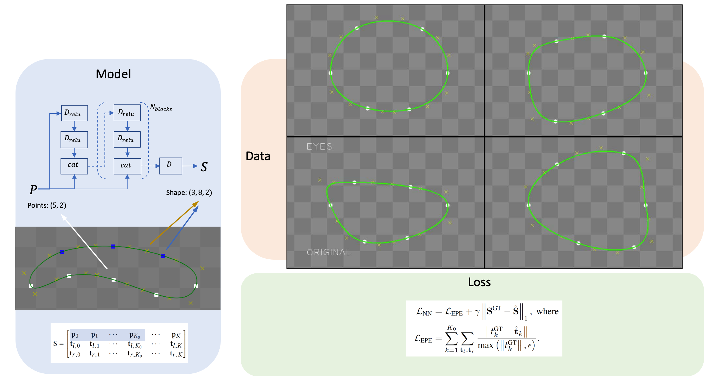
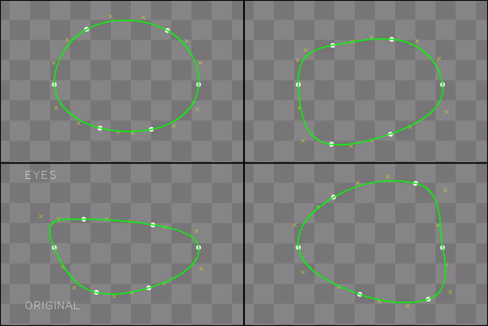

# Dataset for "A Learning-Based Approach to Parametric Rotoscoping of Multi-Shape Systems", WACV 2021

# Virtualenv (python3)
    
    pip install -r requirements.txt
    
# Data: 

Download and unzip the dataset from (link will appear here). It is distributed under a Creative Commons license.

Make sure your assets folder looks like this.

    Rotomation_WACV
        |- sir_lionel.py
        |- WACV_dataset_sir_lionel
            |- shot0-4
            |- CG
            |- test
            |- license.txt

# Starter Code 

Run this script

    python sir_lionel.py
    
Successful run will produce this output

    Validation passed
    Visualizing <shot>/<frame> with asset files {dictionary: file_name}
    Written sample in /some/folder/sample.png for visual inspection
    Mode GT, sample 1, image_tensor (8, 800, 800, 3), points_tensor (8, 43, 2)
    Mode test, sample 1, image_tensor (8, 800, 800, 3), points_tensor (8, 28, 2)
    Mode CG, sample 1, image_tensor (8, 800, 800, 4), points_tensor (8, 45, 2)
    tf.data loading successful!

Visual inspection of ```/some/folder/sample.png``` should look like


      

# Project description

## Motivation
Rotoscoping is a technique used to obtain object segments from a video that can subsequently be extracted for use in compositing or further editing in the visual effects post-processing pipeline. 
These object segments must be spatially and temporally smooth in order for compositing artifacts to be imperceptible to the human eye, and they must be parametric so that an artist can iteratively modify them until the composite meets the desired goal.



## Parametric Bezier Contours
The goal here is to learn and accurately predict multiple shapes, open and closed, in relation to the image while ensuring spatial smoothness and temporal coherence. We adopt the parametric Bezier representation for the shapes, with points and tangents, which ensures spatial smoothness and preserves sub-pixel accuracy under transformation.



## Task specific features
The raw assets from the compositor's workspace consists of contours with arbitrary points and tangents that are not semantically consistent and hence not trainable. Given several instances of a similar task, our first step is to identify the interactions among shapes and harvest a set of semantically consistent landmark points. We then re-vectorize the original contours based on these landmark points to obtain a new consistent representation. The resulting set of points and tangents are considered to be the relevant features for this task and together with the image, constitute the ground truth data which is ready for training.


## Methodology
Next step is to make sure that the predicted shapes are temporally coherent. We break the image-to-shape computation into two steps - the first model predicts the landmark points given an image, and the second group of models predict the multitude of shapes - each conditioned on a subset of landmark points. During deployment on a video sequence, first the landmark points are predicted separately for all the frames. Next, the landmark points are fused with cross-frame predictions based on optical flow vectors - thus reducing jitter and ensuring temporal coherence. Lastly, the shapes are predicted from fused landmark points separately for all the frames.



## DeJitter
Here are a couple of examples showing how de-jittering improves the coherence of predicted landmarks.


## Formal description
In this formal description, we introduce the notations: I is the image, S_raw are the raw assets, S denotes the re-vectorized shapes which are the features of this task, and P is the semantically consistent subset of points in S which are our landmarks. Rather than learning the end-to-end model E[S|I], we learn two models E[P|I] and E[S|P]. This allows the artist to perfect the landmarks using a combination of automatic de-jitter and interactive touch-ups before producing the final shapes. 



## Landmark Prediction
Our landmark model is an extension of the EfficientNetBx architecture. The loss function includes various provisions to handle scales of shapes, significance of individual landmarks and working with missing data.



To increase the effectiveness of our minimal dataset, we augment the ground truth images by randomizing brightness, blurring, warping, flipping and also adding backgrounds and occlusions. This is where we also take advantage of the availability of the object files for the 3D-printed puppet in the shot. We add CG renders of various viewpoints and expressions to the dataset, after annotating with projected 3D landmarks.


## Shape Prediction
For the shape model, we adopt a custom multi-layer neural network with skip connections. The loss function includes a combination of end point error for tangents and L1-norm for the whole shape.



We augment the ground truth shapes by warping and twiddling the points along the shape perimeter followed by re-vectorization.




# Publications

A Learning-Based Approach to Parametric Rotoscoping of Multi-Shape Systems, WACV 2021 (link to appear)

[Rotomation: AI Powered Rotoscoping at LAIKA, Siggraph 2020](https://dl.acm.org/doi/pdf/10.1145/3388767.3407315)

      
# Citations

If you use this dataset for your project, please consider citing the WACV2021 and/or Siggraph2020 papers

    <WACV2021 citation will be updated soon>

    @inproceedings{10.1145/3388767.3407315,
    author = {Stringer, Jeff and Sundararajan, Narayan and Pina, James and Kar, Swarnendu and Dabby, Nadine L. and Lin, Adelle and Bermudez, Luis and Hilmarsdottir, Sara},
    title = {Rotomation: AI Powered Rotoscoping at LAIKA},
    year = {2020},
    isbn = {9781450379717},
    publisher = {Association for Computing Machinery},
    address = {New York, NY, USA},
    url = {https://doi.org/10.1145/3388767.3407315},
    doi = {10.1145/3388767.3407315},
    abstract = { In an ongoing collaboration, LAIKA and Intel are combining expertise in machine learning and filmmaking, to develop AI powered tools for accelerating digital paint and rotoscope tasks. LAIKA’s stop-motion films, with unique character designs and 3d printed facial animation, provide challenging use cases for machine learning methodologies. Intel’s team has focused on tools that fit seamlessly into the workflow and deliver powerful automation.},
    booktitle = {Special Interest Group on Computer Graphics and Interactive Techniques Conference Talks},
    articleno = {39},
    numpages = {2},
    location = {Virtual Event, USA},
    series = {SIGGRAPH '20}
    }

# Copyright

    Copyright 2020 Intel Corporation.

    This software and the related documents are Intel copyrighted materials, and your use of them is governed by the express license under which they were provided to you ("License"). Unless the License provides otherwise, you may not use, modify, copy, publish, distribute, disclose or transmit this software or the related documents without Intel's prior written permission.

    This software and the related documents are provided as is, with no express or implied warranties, other than those that are expressly stated in the License.

